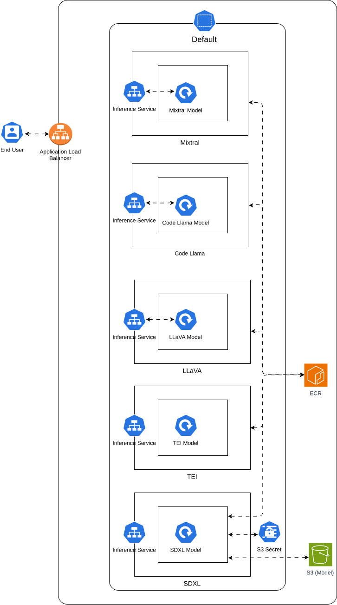

# A Multi-Model, Multi-Modal Agent Based Chatbot on EKS

# Objective:
The goal is to design a chatbot with an interface that can assist a user at different tasks. Notably, it can
- perform search on the web
- answer queries regarding an image
- generate images
- answer queries regarding a document
- retain memory of the user's interactions with it.

Additionally, the chatbot needs to be deployable on a scalable backend using Kubernetes.

# Tech Stack

The project uses state-of-the-art libraries for inference.

### Models used:
- [Mixtral-8x7B-Instruct-v0.1 (6.0bpw/exl2)](https://huggingface.co/turboderp/Mixtral-8x7B-instruct-exl2/tree/6.0bpw)
	- This is used as our main model for the agent. It is also used as the model for RAG.
- [SDXL-Turbo](https://huggingface.co/stabilityai/sdxl-turbo)
	- A fast image generation model that requires 1-2 steps.
- [LLaVA-1.6](https://huggingface.co/liuhaotian/llava-v1.6-vicuna-13b)
	- A multi-modal instruction following modelfor describing uploaded.
- [CodeLlama-34b-Instruct-hf  (4.65bpw/exl2)](https://huggingface.co/turboderp/CodeLlama-34B-instruct-exl2/tree/4.65bpw)
	- An instruction-tuned model for code synthesis
- [bge-small-en-v1.5](https://huggingface.co/BAAI/bge-small-en-v1.5)
	- An embedding model used for RAG on uploaded documents.

### Inference Libraries used:
- [ExLlamaV2](https://github.com/turboderp/exllamav2)
	- A quantization library which claims to have a better compression and inference latency compared to AWQ and GPTQ models. Also, has a number of bits representation. It is used for the Mixtral and Code Llama models. [TabbyAPI](https://github.com/theroyallab/tabbyAPI) provides an OpenAI-compatible API for ExLlamaV2 models.
- [SGLang](https://github.com/sgl-project/sglang)
	- An inference library built on top of vLLM with [a higher throughput](https://github.com/sgl-project/sglang?tab=readme-ov-file#benchmark-and-performance). It has native integration for multi-modal models like LLaVA.
- [Text-Embeddings Inference](https://github.com/huggingface/text-embeddings-inference)
	- An embeddings inference library by HuggingFace to host our embeddings model.
- [TorchServe](https://github.com/pytorch/serve)
	- A production grade library for serving PyTorch models. It is used for the SDXL-Turbo model.

Langchain is used for building the agent.

The frontend has been created in Streamlit. The models are deployed on EKS.

# Demo

# Optimizing for Scaling
Our models are ~73GB in size! Each time a node is to be provisioned, these files will be downloaded on each node and can take a significant time. This is in addition to the docker images needed for inference. We can implement a few tricks to save bandwidth as well as time - ~14 minutes per model!  

See details [here](./optimize.md).

# Key Findings:
- Do not trust LLM benchmarks. A 34B model* with a high-score on HF leaderboard performed extremely poor as an agent.
- Quantization can lobotomize an LLM; performance degrades even at following instructions or choosing the right tool.
- The same prompts *might* not work for different models.

\* not named for legal reasons :wink:

# Architecture

  
 Click To See Diagram

