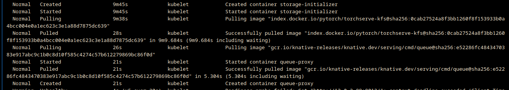
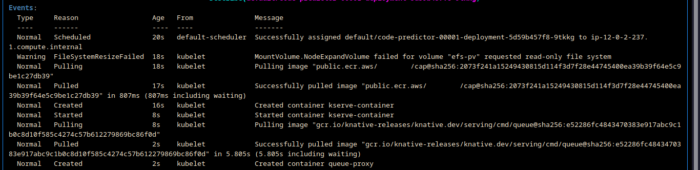

# Optimizing for Scaling

Using the tricks here, we can save a lot of time. This can be quite useful in a situation where the demand  increases and more nodes are to be provisioned.

The models are stored in EFS and mounted as PV with a PVC. This saves the bandwidth for the models. 

Reducing the docker image fetch time is a bit tricky! This was done via
- using a Bottlerocket AMI (instead of the default Amazon Linux)
- creating an instance, fetching the docker images, and then creating a snapshot.
- using the snapshot above as the secondary volume in our cluster for the nodes.

To see a comparison, here is a TorchServe model whose image was not prefetched.

It took  8m50s (9m38s -> 28s). Quite an overhead!

Compare it with our own serving image which was prefetched.

It took 1s (18s -> 17s)! Super fast!

